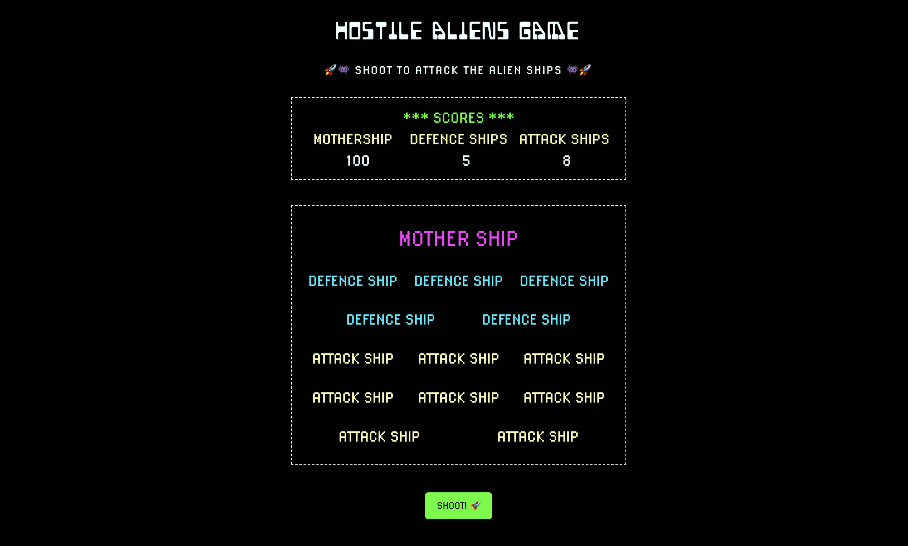

# Hostile Aliens Game

> _To create a simple text only game loosely based on Space Invaders. The game should contain a single button that hits a random alien ship in the fleet. Each time the button is pressed, a random alien ship is hit and its hit points are reduced. Once an alien ships points have hit zero the ship is destroyed and can’t be hit again. The game is over once all alien ships have been destroyed. For best results, approach this challenge with an OOP mindset although some functions may be needed._  

#### Project Link [_here_](https://amiehannah.github.io/hostile-aliens-game/).

##

## User Story:

- As a player of this game, I want to be able to .....
  , so that I am able to communicate effectively.

- Given that I start the game, I should see the whole alien fleet on the board (with **_1 Mothership_**, **_5 Defence Ships_** and **_8 Attack Ships_**) and a shoot button.
- The alien fleet should be as below:

| Alien Ship   | Quantity | Starting Points | Hit Points |
| ------------ | :------: | :-------------: | :--------: |
| Mothership   |    1     |       100       |    - 9     |
| Defence Ship |    5     |       80        |    - 10    |
| Attack Ship  |    8     |       45        |    - 12    |

- Given that I press the shoot button, I want to be able to fire at a random alien ship each time.
- Given that I randomly hit an alien ship, I want to visually be able to see which ship has been hit and see it's hit points decrease.
- Given that the points of a ship hit 0, they should be sunk and disappear from view.
- Given that the either the **_Motherships_** current points are equal to 0 - OR - if the **_Attack Ship_** score and **_Defence Ship_** scores are both equal to 0 (whichever happens first), the game is over.
- Given that the game is over, then I should be provided with an option to restart the game again.

## Functionality:  

1. Using an OOP approach, I created a class of AlienShip which contained the following methods getCurrentScore(), reduceShipPoints(), gameOver()

2. Dynamically created the alien fleet, gameboard and score board.  
   Pushed all alien ships into a blank array, ready to start the game.  
   Once all elements of the game had been created it was now time to look at writing the functions to interact and hit these ships.

3. Clicking the 'shoot button' triggers the handleClick() function, a random ship from the array of alien ships is selected and so long as the scores are greater than 0, then the shootAlienShips() function is then run.

4. I only want to shoot the alien ship if it's current points are greater than 0 AND if the alien ship hasn't already been sunk.  
   I use an if statement to check. If it doesn't meet this condition, it is removed from the shipsArray so it cannot be hit again and a css class of 'sunk' is applied to this ship, so visually it is out of play.

5. However, if the current points of the randomShip are greater than 0 AND it hasn't already been sunk, the ship can be hit and the method reduceShipPoints() can be run.  
   CSS styles of 'hit' can be applied to this randomShip, flashing red to show the user it has been hit.

6. The score board is simultaneously updated to reflect each alien ships that is either hit or sunk.

7. Once, the motherships current points are equal to 0 - OR - if the attackShip score and defenceShip scores are both equal to 0 (whichever happens first), this then triggers the gameOver() method.  
   The gameOver modal is then visible to the user and values are reset ready to start the game again.

## Technologies & Features:

- JavaScript
- OOP approach
- Unit Tested using Jest
- HTML5
- CSS
- Mobile first / responsive design
- Git Version Control

## Unit Testing:  

I used Jest to test the alien class, extracting it into a separate js file, to check that the properties and methods on the class are working correctly.

## Further Developments:

- To add in a game introduction, informing user of how to play.
- Refactor code to ensure the functions are more 'pure'.

## Contact

Created by [Amie Edwards](mailto:amie.edwards17@gmail.com)
